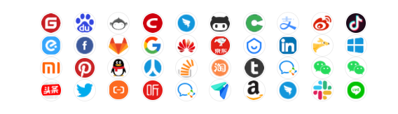

<p align="center">
    <a href="" target="_blank">
      
    </a>
</p>
<h1 align="center">OneAuth</h1>
<p align="center"><strong>小而全而美的第三方登录开源组件。<br><em>持续更新中～</em></strong></p>
<div align="center">
    <a href=""></a>
    <a href=""></a>
</div>


## 背景

全🌱：已集成十多家第三方平台（国内外常用的基本都已包含），仍然还在持续扩展中（开发计划）！ </br>
简🚀：API就是奔着最简单去设计的（见后面快速开始），尽量让您用起来没有障碍感！


项目参考了 JustAuth 开源项目：**[JustAuth](https://github.com/justauth/JustAuth)**

-------------------------------------------------------------------------------
<p align="center">
</img>
</p>

-------------------------------------------------------------------------------

## 功能&设计🚀


```txt
OneAuth 核心代码
├─config	--配置文件的存放
├─utils	--工具类存放模块
└─score	--评分模块

sql-slow-mirror-sample --[示例]示例 demo 可直接使用
```

## 快速开始🌈

### 引入依赖
```xml
<dependency>
    <groupId>xxx</groupId>
    <artifactId>xxx</artifactId>
    <version>xx</version>
</dependency>
```

如下**任选一种** HTTP 工具 依赖，_项目内如果已有，请忽略。另外需要特别注意，如果项目中已经引入了低版本的依赖，请先排除低版本依赖后，再引入高版本或者最新版本的依赖_

- hutool-http

  ```xml
  <dependency>
      <groupId>cn.hutool</groupId>
      <artifactId>hutool-http</artifactId>
      <version>5.7.7</version>
  </dependency>
  ```

- httpclient

  ```xml
  <dependency>
  	<groupId>org.apache.httpcomponents</groupId>
    	<artifactId>httpclient</artifactId>
    	<version>4.5.13</version>
  </dependency>
  ```

- okhttp

  ```xml
  <dependency>
    <groupId>com.squareup.okhttp3</groupId>
    <artifactId>okhttp</artifactId>
    <version>4.9.1</version>
  </dependency>
  ```


### 使用方法


## 优势

1. 接入成本低：只需要设置好配置文件

### 贡献者

- [聪](https://github.com/lhccong) - 主要开发者

### 许可证

该项目采用 MIT 许可证。详细信息请参阅 [LICENSE](LICENSE) 文件。

### 联系方式

如有任何疑问或建议，欢迎联系项目主要开发者：

- 电子邮件: 771901874@qq.com

### 注意事项

- 本项目仅供学习和参考使用，未经授权请勿用于商业目的。
- 欢迎贡献代码或者提出建议，您可以通过提出 Issue 或者 Pull Request 的方式参与到项目中来。

## 参与贡献

如果您对项目有任何建议或想要贡献代码，欢迎提交 Issue 或 Pull Request。我们期待您的参与，共同完善和改进 SQL 慢镜项目！

---

感谢您对 OneAuth 项目的关注和支持！🕵️‍♀️